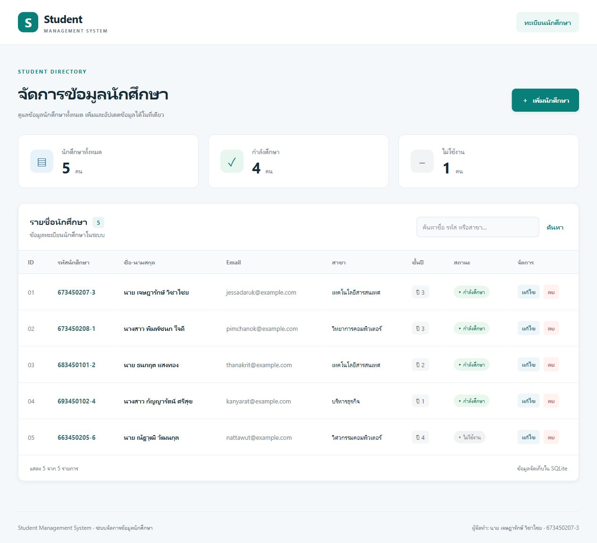

# Student Management System

ระบบจัดการข้อมูลนักศึกษาด้วย Next.js, TypeScript, Tailwind CSS, Prisma ORM และ SQLite รองรับการเพิ่ม ดู แก้ไข และลบข้อมูล ใช้ภาษาไทยเป็นหลัก พร้อมค้นหาชื่อ รหัสนักศึกษา และสาขา

ศึกษาโครงสร้างและแนวทาง CRUD จาก [บทเรียน Next.js CRUD ของ IT NKC](https://it-nkc.github.io/nextjs-crud/) ใช้ App Router และ Server Actions ตามแนวทางตัวอย่าง โดยเลือก Prisma 6.19.3 เพื่อใช้ SQLite ผ่าน Prisma Client ได้โดยตรง และเพิ่ม validation/การจัดการข้อผิดพลาด

## ตัวอย่างหน้าจอ



ภาพนี้ถ่ายจากหน้าเว็บที่รันจริงในเครื่อง พร้อมข้อมูลตัวอย่างหลัง seed

## ฟังก์ชันของระบบ

- เพิ่มข้อมูลนักศึกษา: รหัสนักศึกษา ชื่อ-นามสกุล อีเมล สาขา ชั้นปี และสถานะ
- แสดงข้อมูลนักศึกษาในตาราง พร้อมจำนวนทั้งหมด กำลังศึกษา และไม่ใช้งาน
- ค้นหาด้วยชื่อ รหัส หรือสาขา
- แก้ไขข้อมูลเดิม พร้อมเติมข้อมูลลงในฟอร์มโดยอัตโนมัติ
- ลบข้อมูลหลังยืนยัน สามารถยกเลิกก่อนลบได้
- แสดง badge สถานะ และรองรับมือถือด้วยตารางเลื่อนแนวนอน
- ตรวจสอบข้อมูลทั้ง browser และ server พร้อมแจ้งรหัสซ้ำ และเก็บค่าฟอร์มเมื่อบันทึกไม่สำเร็จ

## เทคโนโลยีที่ใช้

| เทคโนโลยี | หน้าที่ |
| --- | --- |
| Next.js 16.3.8 | App Router, Server Components และ Server Actions |
| React 19.2.4 | UI และสถานะฟอร์ม |
| TypeScript 5 | ตรวจสอบชนิดข้อมูล |
| Tailwind CSS 4 | utility classes และรูปแบบ responsive |
| Prisma 6.19.3 | ORM, schema, migration และ seed |
| SQLite | ฐานข้อมูลแบบไฟล์ |
| Zod 4 | ตรวจสอบและแปลงข้อมูลฝั่งเซิร์ฟเวอร์ |
| Node.js / npm | ติดตั้ง dependencies และรันโปรเจกต์ |

ทดสอบด้วย Node.js 24.18.0 และ npm 11.16.0 แนะนำ Node.js 24 LTS มี package-lock.json สำหรับติดตั้งเวอร์ชันเดียวกัน

## การติดตั้ง

เมื่อเผยแพร่ repository แล้ว ให้แทน `<repository-url>` ด้วย URL จริง:

```bash
git clone <repository-url>
cd student-management-crud
npm install
```

ถ้าได้รับโปรเจกต์เป็นไฟล์ ให้เปิด Terminal ในโฟลเดอร์โปรเจกต์แล้วเริ่มจาก `npm install`

สร้างไฟล์ environment บน PowerShell:

```powershell
Copy-Item .env.example .env
```

บน macOS/Linux ใช้:

```bash
cp .env.example .env
```

ค่าใน `.env`:

```env
DATABASE_URL="file:./dev.db"
```

เตรียม Prisma Client, ใช้ migration ที่มีในโปรเจกต์ และ seed ตัวอย่าง 5 รายการ:

```bash
npm run db:setup
npm run dev
```

เปิด [http://localhost:3000](http://localhost:3000) หน้า `/` และ `/students` เป็นหน้ารายชื่อนักศึกษา

หาก npm 11 แจ้งว่า install scripts ถูกบล็อก ให้อนุญาตเฉพาะ dependencies ที่โปรเจกต์ต้องใช้ แล้วรัน setup อีกครั้ง:

```bash
npm approve-scripts @prisma/client prisma @prisma/engines esbuild
npm run db:setup
```

คำสั่งฐานข้อมูลแยก:

```bash
npm run db:generate
npm run db:migrate
npm run db:seed
```

`db:migrate` สร้างไฟล์ SQLite เฉพาะเมื่อยังไม่มีไฟล์ เพื่อรองรับ Prisma 6 บน Windows และใช้ `prisma migrate deploy` กับ migration ที่เก็บใน Git ไม่เขียนทับฐานข้อมูลเดิม ส่วน seed ใช้ upsert และไม่เขียนทับข้อมูลที่มีรหัสตรงกัน

บน Windows ให้หยุด dev/start ด้วย Ctrl+C ก่อนรัน `db:setup` หรือ `db:generate` เพื่อไม่ให้ Prisma engine ถูกล็อก หากพบ `EPERM ... query_engine-windows.dll.node` ให้หยุดเซิร์ฟเวอร์แล้วรันคำสั่งใหม่

เมื่อแก้ schema ระหว่างพัฒนา ให้สร้าง migration ใหม่:

```bash
npx prisma migrate dev --name describe_change
```

## วิธีเปิดครั้งถัดไป

เปิด Terminal ในโฟลเดอร์นี้ แล้วใช้ `npm run dev` ไม่ต้อง seed ซ้ำ ข้อมูลที่เพิ่มไว้คงอยู่ใน `prisma/dev.db` ถ้าเพิ่ง clone หรือยังไม่ได้เตรียมฐานข้อมูล ให้ทำขั้นตอนติดตั้งก่อน

รันแบบ production:

```bash
npm run build
npm start
```

## วิธีการใช้งาน

1. **ดูรายชื่อ:** เปิดหน้าแรก ตารางแสดง ID รหัส ชื่อ อีเมล สาขา ชั้นปี สถานะ และปุ่มจัดการ ใช้ช่องค้นหาแล้วกด “ค้นหา” หรือกด “ล้าง” เพื่อกลับมาดูทั้งหมด
2. **เพิ่มนักศึกษา:** กด “เพิ่มนักศึกษา” กรอกข้อมูลและกด “บันทึกนักศึกษา” เมื่อสำเร็จระบบกลับหน้ารายชื่อพร้อมข้อความแจ้ง
3. **แก้ไขนักศึกษา:** กด “แก้ไข” ของแถวที่ต้องการ เปลี่ยนข้อมูลแล้วกด “บันทึกการแก้ไข” หรือ “ยกเลิก”
4. **ลบนักศึกษา:** กด “ลบ” ตรวจสอบชื่อในหน้าต่างยืนยัน กดยืนยันเพื่อลบถาวร หรือยกเลิกเพื่อเก็บข้อมูลไว้

รหัสนักศึกษาห้ามซ้ำ ใช้ตัวอักษรอังกฤษ ตัวเลข และขีดกลางได้ ชื่ออย่างน้อย 2 ตัวอักษร สาขาห้ามว่าง ชั้นปีเป็นจำนวนเต็ม 1–8 อีเมลไม่บังคับแต่ถ้ากรอกต้องมีรูปแบบถูกต้อง สถานะเลือก “กำลังศึกษา” หรือ “ไม่ใช้งาน”

## Database

- Schema: `prisma/schema.prisma`
- Migration: `prisma/migrations/`
- Seed: `prisma/seed.ts` ใช้ข้อมูลสาธิตและอีเมลโดเมน example.com
- SQLite: `prisma/dev.db` ตามค่าใน `.env` ไม่เก็บไฟล์ฐานข้อมูลใน Git
- Student มี `id`, `studentCode` (unique), `name`, `email` (nullable), `major`, `year`, `status`, `createdAt`, `updatedAt`
- `createdAt` สร้างอัตโนมัติ และ `updatedAt` อัปเดตเมื่อแก้ไขข้อมูล

## โครงสร้างโปรเจกต์

```text
app/
  layout.tsx                    ส่วนหัวและข้อมูลผู้จัดทำ
  globals.css                   รูปแบบ UI และ responsive
  page.tsx                      READ รายชื่อ สถิติ และค้นหา
  error.tsx                     หน้าแจ้งข้อผิดพลาด
  not-found.tsx                 หน้าไม่พบข้อมูล
  students/
    page.tsx                    รายชื่อที่ /students
    actions.ts                  CREATE / UPDATE / DELETE
    student-form.tsx            ฟอร์มร่วมสำหรับเพิ่มและแก้ไข
    delete-button.tsx           ปุ่มลบพร้อมยืนยัน
    create/page.tsx             หน้าเพิ่ม
    [id]/edit/page.tsx          หน้าแก้ไข
lib/
  prisma.ts                     Prisma Client singleton
  validation.ts                 Zod schema และประเภทผลลัพธ์
prisma/
  schema.prisma                 Student model
  migrations/                   SQL migrations
  seed.ts                       ข้อมูลตัวอย่าง 5 รายการ
scripts/prepare-db.mjs           เตรียมไฟล์ SQLite ที่ยังไม่มี
tests/validation.test.ts         ทดสอบ validation
docs/images/home.png            ภาพหน้าจอจริง
docs/TESTING.md                  ผลการตรวจสอบ
.env.example                    ตัวอย่างการตั้งค่า
```

## การทดสอบ

```bash
npm test
npm run typecheck
npm run build
npm audit
```

ดูผลทดสอบและขั้นตอนตรวจ CRUD ผ่านหน้าเว็บใน [docs/TESTING.md](./docs/TESTING.md)

โปรเจกต์นี้เป็นระบบสาธิตสำหรับรันในเครื่อง โดย dev/start ผูกกับ 127.0.0.1 ยังไม่มีระบบล็อกอิน หากนำไปเปิดให้ใช้งานร่วมกันต้องเพิ่ม authentication และ authorization ก่อน

## Git และ GitHub

มี `.gitignore` สำหรับ node_modules, build output, `.env`, ฐานข้อมูล และ logs ส่วน `.env.example`, migrations, source และ screenshot เก็บใน Git ได้

หากยังไม่มี GitHub Repository ให้ติดตั้ง GitHub CLI จาก [เว็บไซต์ทางการ](https://cli.github.com/) แล้วเปิด Terminal ใหม่ในโฟลเดอร์โปรเจกต์:

```bash
gh auth login
gh repo create student-management-crud --public --source=. --remote=origin --push
```

หลัง push ให้ตรวจว่า repository เป็น Public และ README แสดงภาษาไทยและภาพ `docs/images/home.png` ถูกต้อง ไม่ commit credential จริงหรือฐานข้อมูลส่วนบุคคล

## ผู้จัดทำ

นาย เจษฎารักษ์ วิชาไชย  
รหัสนักศึกษา 673450207-3
